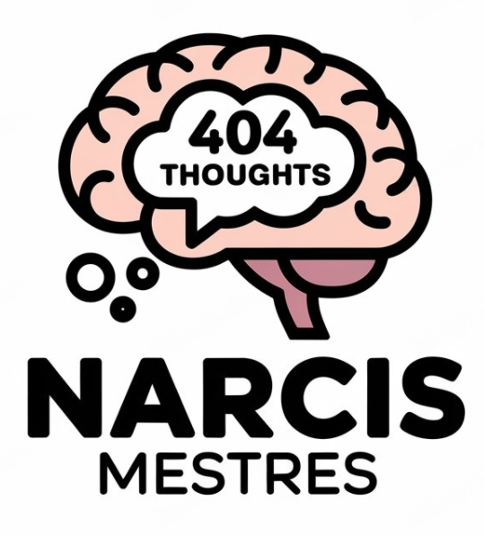
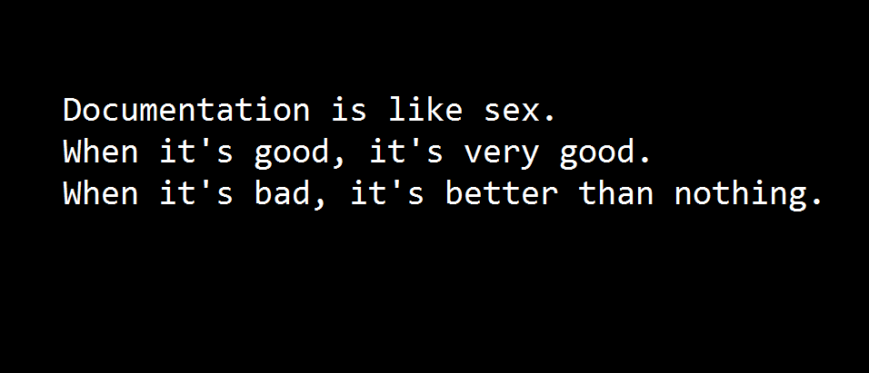

  

# Welcome, Fellow Explorer! 🚀

After years of hearing "Narcis! This should be a post!" or answering the same question for the umpteenth time, I've decided to put everything together in one place. Think of this as my final attempt to condense the chaos of knowledge I've gathered along the way.

As someone once wisely said, "If you teach it, you learn it twice." This blog is my version of the ["Feynman Technique"](https://en.wikipedia.org/wiki/Feynman_Technique)📚, a journey to deepen my understanding while sharing insights with you. ✨

## My Mission 🎯

Here, I aim to create a space with minimal friction for sharing insights on topics like **Kubernetes**, **DevSecOps**, **CI/CD**, **Platform Engineering**, and **Developer Experience**, and everything in between! Whether you're a seasoned pro or just starting out, I hope you'll find valuable information that resonates with you.

My approach is simple: I don’t aim for perfection from the get-go. I’d rather publish a draft than write the "El Quijote" of blog posts. I trust you, the reader, to reach out if something piques your interest but lacks detail. Your feedback will inspire me to expand and improve! 🌱

If you get this, you’ll understand my mantra:

This quote resonates with my philosophy on documentation: when it's done right, it's incredibly valuable, but even the imperfect can serve a purpose. 📖

## Join the Conversation! 💬

I wholeheartedly encourage you to leave feedback or share your thoughts! Your insights will help shape this community. If you want to dive deeper into discussions, feel free to connect with me on [GitHub](https://github.com/nar6mes3) and [LinkedIn](https://www.linkedin.com/in/narcis-mestres/). Let’s build a community of knowledge together! 🤝

## What's Next? 🔮

Stay tuned for upcoming posts where I dive deeper into the realms of technology, best practices, and maybe even a sprinkle of humor along the way. Together, we can make complex topics more accessible and enjoyable. 😄
